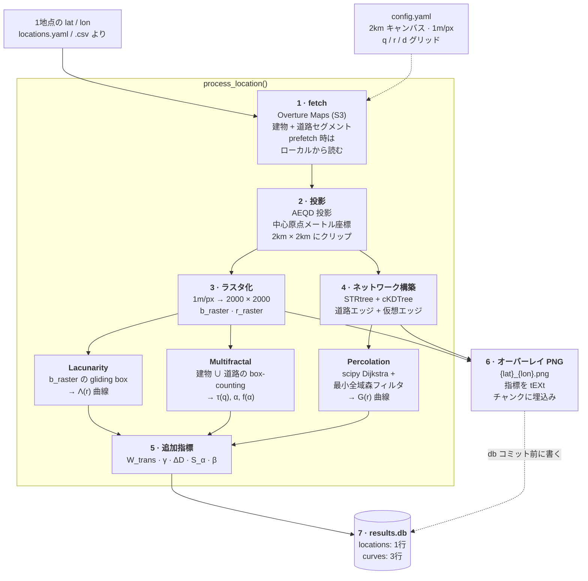
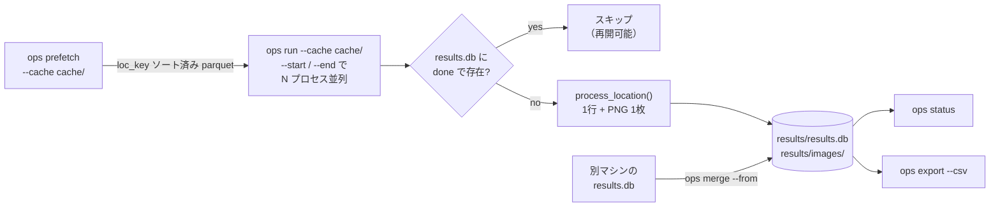

# opensparsity

[English](README.md) · **日本語**

都市空間の Open-Sparsity 指標パイプライン。任意の緯度経度について
[Overture Maps](https://overturemaps.org/) から建物・道路を取得し、ラスタ化・ネットワーク構築・
指標計算（Lacunarity / MFA / Percolation / 追加指標）を行う。

**成果物は 1地点 = 1画像 + SQLite の1行だけ**（中間ファイルなし）:

```
results/
├── results.db            # 全地点の指標・曲線・処理ステータス（これが唯一の数値成果物）
└── images/
    └── {lat}_{lon}.png   # 建物・道路ラスタ + ネットワークのオーバーレイ（メタデータ埋込み）
```

旧リポジトリ `251229_repro_apple`（1地点 = 7ファイル・8〜15MB）からの移植・再設計版。
1地点あたり約 0.1〜0.8MB + db 数 KB。

---

## 実行して何が出るか

処理した地点ごとに 2000×2000 のオーバーレイが1枚出る。建物ラスタ=濃グレー、道路ラスタ=薄グレー、
道路エッジ=青、仮想エッジ（建物→道路）=水色、建物ノード=赤点。北が上。

| 横浜 — `d = 0.306`, `r_crit = 92 m` | 白川郷 — `d = 0.016`, `r_crit = 72 m` |
| :--- | :--- |
|  |  |

同じ 2km × 2km キャンバス、同じコードパス。構造はまったく違う。

---

## ワークフロー



**モジュールは相互非依存**。`fetch` / `project` / `raster` / `network` / `indicators/*` は
それぞれ単独で import して使える。組み合わせるのは `pipeline.py` だけ。

### バッチ層



`prefetch` があるのは、地点ごとの S3 スキャンが地点によらず約100秒かかるため。全地点の bbox を
まとめて全球 parquet に突き合わせ、1パスで抽出する（`manifest.json` で中断・再開可能）。
以降 `run` はローカルから読む。

---

## 指標と、その裏にある曲線

1地点 1回の `ops run` で3種の曲線が `results.db` に入り、スカラ指標はそこから読み取られる:

<picture>
  <source media="(prefers-color-scheme: dark)" srcset="docs/assets/curves_dark.png">
  
</picture>

| 列 | 記号 | 意味 |
| :--- | :--- | :--- |
| `density` | *d* | 建蔽率相当（GSI）: 建物ラスタの平均 |
| `building_count_density` | — | 建物数 / km² |
| `building_footprint_mean_m2` / `_median_m2` | — | 建物フットプリントのサイズ分布 |
| `road_length_density` | — | 道路総延長 (km) / km² |
| `lacunarity_mean` | Λ̄ | ボックスサイズ走査全体での平均ラクナリティ |
| `lacunarity_slope` | β | Λ(r) ~ r^(−β) の減衰率。急=ズームアウトで均質化、緩=どのスケールでもムラがある |
| `mfa_alpha_width` | Δα | α_max − α_min。特異性スペクトルの幅 |
| `mfa_D0` | D₀ | ボックスカウント次元 |
| `r_crit` | r_crit | argmax_r dG/dr。ネットワークが一気に繋がる接続半径（論文 表1 の定義） |
| `perc_dcrit` | — | 補助指標: G(r) = 0.5 の交差点 |
| `perc_gmax` | — | 到達した最大ジャイアントコンポーネント率 |
| `W_trans` | W_trans | r(G=0.9) − r(G=0.1)。狭い=一気に繋がる（核型）、広い=ダラダラ繋がる（分散型） |
| `gamma` | γ | r_crit における dG/dr。転移の「爆発力」 |
| `Delta_D` | ΔD | D₀ − D₂。質量の集中強度 |
| `S_alpha` | S_α | f(α) の歪度。複雑さの源泉が密度分布のどちら側の裾にあるか |
| `beta` | β | `lacunarity_slope` と同値。表1 の名前で併記しているもの |

曲線を残すのは、新しい指標を思いついたとき再フェッチせずに db だけで追加計算するため。

### コーパス全体で見ると

`density` 単体では潰れる情報が多い。現在 `results.db` にある地点で見ると、密度を固定しても
パーコレーション挙動は1桁のレンジに散る:

<picture>
  <source media="(prefers-color-scheme: dark)" srcset="docs/assets/corpus_dark.png">
  
</picture>

`experiments/exp01_density_breakdown/` ではこれをさらに進め、*d* の識別寄与が一様基準を
割り込む密度水準を推定している。

---

## セットアップ

```bash
uv venv --python 3.12 .venv
uv pip install --python .venv/bin/python -e .

# 図の生成・実験スクリプト用
uv pip install --python .venv/bin/python -e ".[analysis]"
```

## 使い方

```bash
# 実行（クラッシュ・中断しても再実行すれば処理済み地点をスキップして続きから）
.venv/bin/ops run --locations locations.yaml --out results/

# 並列バッチ（同じ db に安全に書ける / WAL モード）
.venv/bin/ops run --locations all.csv --out results/ --start 0    --end 2500 &
.venv/bin/ops run --locations all.csv --out results/ --start 2500 --end 5000 &

# Overture データを一括プリフェッチしてからローカルキャッシュで実行
.venv/bin/ops prefetch --locations all.csv --cache cache/
.venv/bin/ops run --locations all.csv --out results/ --cache cache/

# 進捗
.venv/bin/ops status --out results/

# 別マシンの結果を取り込む（UPSERT）
.venv/bin/ops merge --from /mnt/other/results.db --out results/

# 分析用に CSV へ
.venv/bin/ops export --out results/ --csv metrics.csv
```

主なフラグ: `--force` は処理済み地点も再計算、`--no-image` はオーバーレイを作らず数値のみ。

地点リストは YAML（`{locations: [{name, lat, lon}, ...]}` / 旧形式 `coords: [lat, lon]` も可）
または CSV（`lat, lon[, name]` 列）。

## 設計

- **results.db が真実源**: `locations`（指標＋status）と `curves`（percolation / MFA /
  lacunarity 曲線）
- **行にはコード版と Overture リリース版を記録**: どの実装・どのデータで計算した値か常に追跡可能
- **再開**: 主キー (lat, lon) の UPSERT + status。`--force` で再計算

## 計算実装について

計算コアは旧リポジトリで最適化・検証済みのものをそのまま移植:

- ネットワーク構築: STRtree / cKDTree（旧全走査実装とグラフがビット単位一致することを検証済み）
- Percolation: scipy Dijkstra + 最小全域森フィルタ（旧 networkx 実装と全しきい値一致を7地点で検証済み）
- Overture の古いリリースは S3 から消えるため、fetch が *"No files found"* になったら
  `fetch.py` の `OVERTURE_RELEASE` を更新すること

## 参考実行時間

Apple Silicon, 2km² / 1m px: フェッチ約 100〜120 秒（地点によらずほぼ一定）＋ 計算 5〜35 秒
（建物ノード数の2乗で増加、建物 14,000 ノードのキベラで 35 秒）。

## 図の再生成

README の図は `results.db` から生成しているので、データに追従する:

```bash
.venv/bin/python docs/make_figures.py --db results/results.db --out docs/assets
```

light / dark の2枚組（上の `<picture>` が GitHub のテーマで切り替える）と、オーバーレイ PNG
2枚の縮小版を出力する。軸ラベルは英語＋数式記号のみにして、日本語版・英語版で同じ画像を共用する。

## リポジトリ構成

```
src/opensparsity/
├── cli.py            ops run / prefetch / merge / status / export
├── pipeline.py        他モジュールを組み合わせる唯一の場所
├── fetch.py           Overture (S3) + ローカルキャッシュ読み出し
├── prefetch.py        一括抽出（static / join モード）
├── project.py         AEQD 投影とクリップ
├── raster.py          ラスタ化
├── network.py         グラフ構築
├── render.py          オーバーレイ PNG
├── store.py           results.db
└── indicators/        lacunarity · multifractal · percolation · advanced
docs/                  研究フレーム、技術ノート、図の生成スクリプト
experiments/           exp01 密度崩壊点、exp02 同一密度ペア, ...
```
