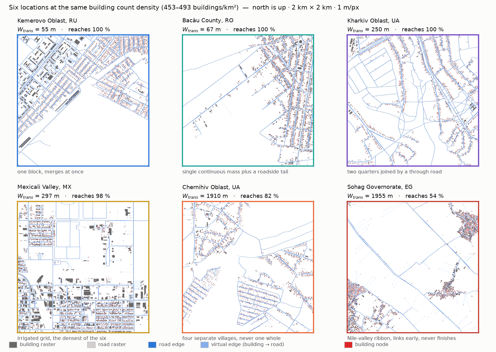
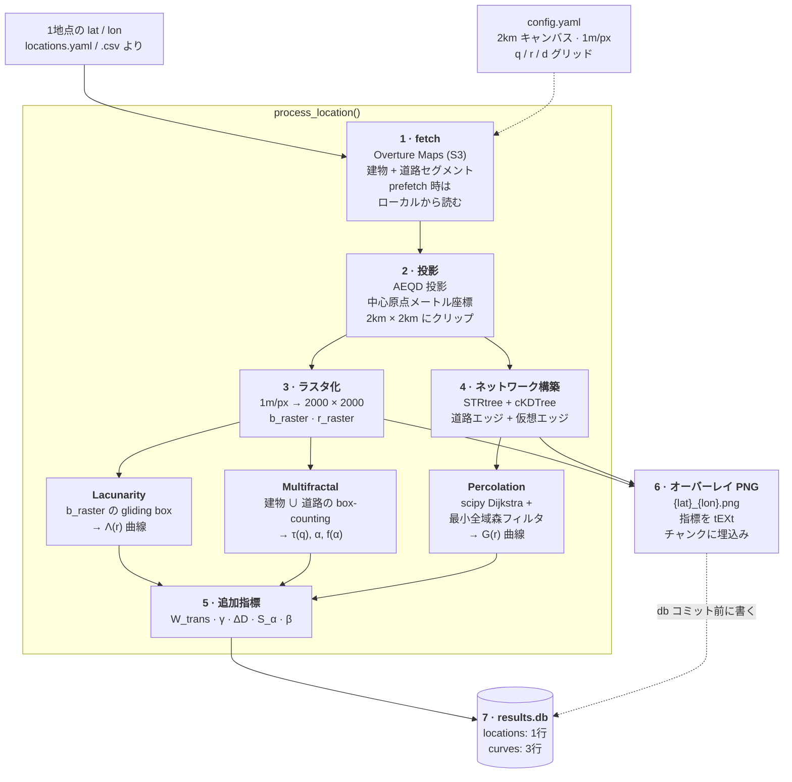
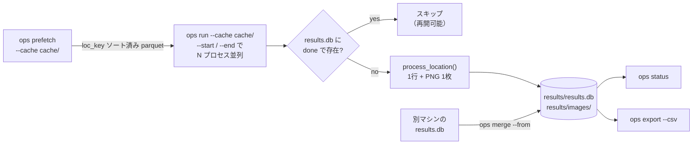
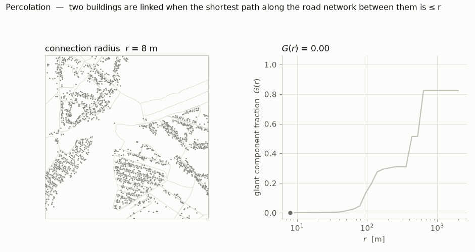
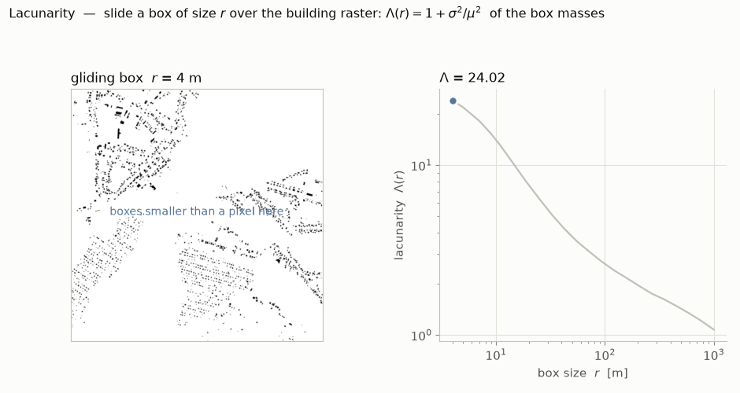
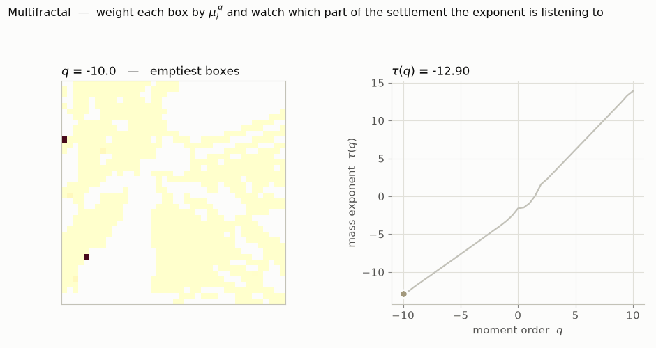

# opensparsity

[English](README.md) · **日本語**

都市空間の Open-Sparsity 指標パイプライン。任意の緯度経度について
[Overture Maps](https://overturemaps.org/) から建物・道路を取得し、ラスタ化・ネットワーク構築・
指標計算（Lacunarity / MFA / Percolation / 追加指標）を行う。

**成果物は 1地点 = 1画像 + SQLite の1行だけ**（中間ファイルなし）:

```
results/
├── results.db            # 全地点の指標・曲線・処理ステータス（これが唯一の数値成果物）
└── images/
    └── {lat}_{lon}.png   # 建物・道路ラスタ + ネットワークのオーバーレイ（メタデータ埋込み）
```

旧リポジトリ `251229_repro_apple`（1地点 = 7ファイル・8〜15MB）からの移植・再設計版。
1地点あたり約 0.1〜0.8MB + db 数 KB。

---

## 実行して何が出るか

処理した地点ごとに 2000×2000 のオーバーレイが1枚出る。建物ラスタ=濃グレー、道路ラスタ=薄グレー、
道路エッジ=青、仮想エッジ（建物→道路）=水色、建物ノード=赤点。北が上。

以下の6地点は**建物数密度をほぼ揃えて**選んである — 453〜493 棟/km²、どの窓も建物ノードは
約1,900。つまり両者を分けているものは「どれだけ建っているか」ではない:

<picture>
  <source media="(prefers-color-scheme: dark)" srcset="docs/assets/samples_dark.png">
  
</picture>

| 地点 | かたち | 棟/km² | *d* | r_crit | W_trans | γ | 到達率 | Λ̄ | Δα | S_α |
| :--- | :--- | ---: | ---: | ---: | ---: | ---: | ---: | ---: | ---: | ---: |
| ケメロヴォ州, RU | 一体の街区、一気に繋がる | 480 | 0.0628 | 112 m | **55 m** | 0.0193 | 100 % | 5.0 | 2.27 | +0.44 |
| バカウ県, RO | 連続した塊＋道沿いの尾 | 493 | 0.0528 | 112 m | 67 m | 0.0187 | 100 % | 5.9 | 2.15 | +0.46 |
| ハルキウ州, UA | 通過道路で結ばれた二街区 | 484 | 0.0351 | 253 m | 250 m | 0.0063 | 100 % | 6.9 | 1.88 | +0.51 |
| メヒカリ盆地, MX | 灌漑グリッド、6地点で最密 | 482 | 0.1009 | 132 m | 297 m | 0.0076 | 98 % | 3.8 | 2.06 | +1.11 |
| チェルニーヒウ州, UA | 独立した4つの村 | 472 | 0.0300 | 556 m | 1910 m | 0.0077 | **82 %** | 7.6 | 1.84 | +1.01 |
| ソハーグ県, EG | ナイル河谷の帯 | 453 | 0.0371 | **51 m** | **1955 m** | 0.0061 | **54 %** | 9.2 | 1.93 | +0.55 |

同じキャンバス、同じコードパス。建物数を揃えてなお `W_trans` は **55m 〜 1955m、36倍**に散り、
6地点のうち2つは観測窓内で一つの連結した集落になることがない。

ソハーグは「早く繋がり始める＝繋がりやすい」という直感への反例になっている。**51m** と
6地点で最も早く連結が始まるのに、到達率は 54% に留まる。転移が*どこで始まるか*と
*どれだけ幅があるか*は独立している。

### コーパスから選んだはずれ値5地点

上の6地点は手で選んだもの。より面白いのは**密度ではなく指標空間で
極端な**地点。`results.db` を中間密度帯（0.003 ≤ *d* ≤ 0.05）・道路データが実在する地点・
転移が 2km の観測窓内で完了する地点に絞ると候補は 1,458地点。これを z-score 化した
9次元 OS ベクトルのマハラノビス距離で並べ、仮想エッジのスター（扇状）を弾いた結果:

<picture>
  <source media="(prefers-color-scheme: dark)" srcset="docs/assets/outliers_dark.png">
  
</picture>

| 地点 | はずれ理由 | *d* | Λ̄ | r_crit | W_trans | γ | Δα | S_α | 建物 |
| :--- | :--- | ---: | ---: | ---: | ---: | ---: | ---: | ---: | ---: |
| Sandoval County, ニューメキシコ州, 米国 | S_α = **−3.6 sd** | 0.0111 | 23.3 | 92 m | 321 m | 0.0064 | 1.81 | −0.30 | 380 |
| Nahirtsi, キーウ州, ウクライナ | Δα = **+3.5 sd** | 0.0290 | 16.8 | 294 m | 1913 m | 0.0089 | 2.42 | +0.19 | 125 |
| 幾春別, 三笠市, 北海道 | γ = **+3.2 sd** | 0.0080 | 35.9 | 72 m | 101 m | 0.0194 | 2.10 | +0.21 | 239 |
| West Kelowna Estates, BC, カナダ | r_crit = **+2.6 sd** | 0.0077 | 34.4 | 1546 m | 1465 m | 0.0067 | 1.79 | +1.17 | 148 |
| Pińczata, gmina Włocławek, ポーランド | Λ̄ = **+2.0 sd** | 0.0032 | 70.8 | 92 m | 144 m | 0.0155 | 1.76 | +0.99 | 165 |

- **Sandoval County** は道路密度 11.2 km/km² もあるのに建物が一角にしかない。造成だけ
  済んで家が建たなかった区画（platted subdivision）。密度では平凡なのに S_α が −3.6 sd
- **幾春別** は炭鉱町の縮小跡。空の谷に固い核が1つだけ残るため、プール内で最も急峻な
  相転移になる（W_trans = 101 m）
- **West Kelowna** は地形拘束型。等高線沿いに住宅が並ぶので局所的には繋がるが、
  全体が繋がるまで 1.5km かかる
- **Nahirtsi** はチョルノービリ立入禁止区域内（原発の約2km東）。巨大建屋と小構造物が
  混在するため、ここで最も広い特異性スペクトルになる

**スター除外は見た目以上に重要。** 建物が道路から遠いと全部が同じ最近傍道路点へ snap して、
オーバーレイが水色の扇で埋まる。これは道路データ欠損の人工物であって空間パターンではない。
`render.py` は各レイヤをアンチエイリアスなしの厳密な RGB で塗るので、扇はピクセル数から
直接検出できる: **はずれ値上位120件のうち 84件がこれで除外された**（仮想エッジ画素 /
道路エッジ画素 ≥ 0.35、プール中位数 0.57）。このフィルタが無いとランキングはほぼ人工物で
埋まる。

---

## ワークフロー



**モジュールは相互非依存**。`fetch` / `project` / `raster` / `network` / `indicators/*` は
それぞれ単独で import して使える。組み合わせるのは `pipeline.py` だけ。

### バッチ層



`prefetch` があるのは、地点ごとの S3 スキャンが地点によらず約100秒かかるため。全地点の bbox を
まとめて全球 parquet に突き合わせ、1パスで抽出する（`manifest.json` で中断・再開可能）。
以降 `run` はローカルから読む。

---

## 指標と、その裏にある曲線

1地点 1回の `ops run` で3種の曲線が `results.db` に入り、スカラ指標はそこから読み取られる:

<picture>
  <source media="(prefers-color-scheme: dark)" srcset="docs/assets/curves_dark.png">
  
</picture>

| 列 | 記号 | 意味 |
| :--- | :--- | :--- |
| `density` | *d* | 建蔽率相当（GSI）: 建物ラスタの平均 |
| `building_count_density` | — | 建物数 / km² |
| `building_footprint_mean_m2` / `_median_m2` | — | 建物フットプリントのサイズ分布 |
| `road_length_density` | — | 道路総延長 (km) / km² |
| `lacunarity_mean` | Λ̄ | ボックスサイズ走査全体での平均ラクナリティ |
| `lacunarity_slope` | β | Λ(r) ~ r^(−β) の減衰率。急=ズームアウトで均質化、緩=どのスケールでもムラがある |
| `mfa_alpha_width` | Δα | α_max − α_min。特異性スペクトルの幅 |
| `mfa_D0` | D₀ | ボックスカウント次元 |
| `r_crit` | r_crit | argmax_r dG/dr。ネットワークが一気に繋がる接続半径（論文 表1 の定義） |
| `perc_dcrit` | — | 補助指標: G(r) = 0.5 の交差点 |
| `perc_gmax` | — | 到達した最大ジャイアントコンポーネント率 |
| `W_trans` | W_trans | r(G=0.9) − r(G=0.1)。狭い=一気に繋がる（核型）、広い=ダラダラ繋がる（分散型） |
| `gamma` | γ | r_crit における dG/dr。転移の「爆発力」 |
| `Delta_D` | ΔD | D₀ − D₂。質量の集中強度 |
| `S_alpha` | S_α | f(α) の歪度。複雑さの源泉が密度分布のどちら側の裾にあるか |
| `beta` | β | `lacunarity_slope` と同値。表1 の名前で併記しているもの |

曲線を残すのは、新しい指標を思いついたとき再フェッチせずに db だけで追加計算するため。

### 各曲線がどう計算されているか

3本とも同じ地点（チェルニーヒウ州、2km 窓に独立した村が4つ）。同じジオメトリから
3つの指標が出ていることが見える。

**Percolation.** 建物重心がノード。2棟は**道路網上の最短距離**が *r* 以下のとき連結とみなす。
*r* を伸ばすと村と村が併合していき、`G(r)` は最大成分に含まれる建物の割合。この窓は 82% で
頭打ちになる — 4つ目の村は 2km 以内では最後まで繋がらない。

<picture>
  <source media="(prefers-color-scheme: dark)" srcset="docs/assets/percolation_dark.gif">
  
</picture>

**Lacunarity.** サイズ *r* の箱を建物ラスタ上で滑らせ、箱ごとの質量について
Λ(r) = 1 + σ²/μ² を取る。小さい箱はほぼ空の場所と建物が詰まった場所を別々に見るので Λ は大きく、
*r* が大きくなると両方を平均して 1 に近づく。この減衰率が `β`。

<picture>
  <source media="(prefers-color-scheme: dark)" srcset="docs/assets/lacunarity_dark.gif">
  
</picture>

**Multifractal.** 箱を μᵢ^q で重み付けする。*q* が負だと重みはほぼ全部「最も疎な箱」に乗り、
正だと「最も密な核」に乗る。*q* = 0 では占有箱を等しく数える。*q* を振ると τ(q) が描かれ、
Δα・ΔD・S_α はそこから読み取る。このアニメーションは**各指数が集落のどの部分を
聞いているか**を見せるためのもの。

<picture>
  <source media="(prefers-color-scheme: dark)" srcset="docs/assets/multifractal_dark.gif">
  
</picture>

### コーパス全体で見ると

`density` 単体では潰れる情報が多い。DEGURBA層化サンプルの実現分 **16,257地点**で見ると、
密度を固定してもパーコレーション挙動は1桁のレンジに散る。上の6地点は各パネルの色で示した:

<picture>
  <source media="(prefers-color-scheme: dark)" srcset="docs/assets/corpus_dark.png">
  
</picture>

再現するには `--corpus <realized_sample.csv>` を渡す。省略するとローカルの `results.db` に
あるものだけで描かれる。`r_crit` の横縞は本物で、パーコレーションの距離グリッド
（`config.yaml` の `d_steps`）による量子化。

`experiments/exp01_density_breakdown/` ではこれをさらに進め、*d* の識別寄与が一様基準を
割り込む密度水準を推定している。

---

## セットアップ

```bash
uv venv --python 3.12 .venv
uv pip install --python .venv/bin/python -e .

# 図の生成・実験スクリプト用
uv pip install --python .venv/bin/python -e ".[analysis]"
```

## 使い方

```bash
# 実行（クラッシュ・中断しても再実行すれば処理済み地点をスキップして続きから）
.venv/bin/ops run --locations locations.yaml --out results/

# 並列バッチ（同じ db に安全に書ける / WAL モード）
.venv/bin/ops run --locations all.csv --out results/ --start 0    --end 2500 &
.venv/bin/ops run --locations all.csv --out results/ --start 2500 --end 5000 &

# Overture データを一括プリフェッチしてからローカルキャッシュで実行
.venv/bin/ops prefetch --locations all.csv --cache cache/
.venv/bin/ops run --locations all.csv --out results/ --cache cache/

# 進捗
.venv/bin/ops status --out results/

# 別マシンの結果を取り込む（UPSERT）
.venv/bin/ops merge --from /mnt/other/results.db --out results/

# 分析用に CSV へ
.venv/bin/ops export --out results/ --csv metrics.csv
```

主なフラグ: `--force` は処理済み地点も再計算、`--no-image` はオーバーレイを作らず数値のみ。

地点リストは YAML（`{locations: [{name, lat, lon}, ...]}` / 旧形式 `coords: [lat, lon]` も可）
または CSV（`lat, lon[, name]` 列）。

## 設計

- **results.db が真実源**: `locations`（指標＋status）と `curves`（percolation / MFA /
  lacunarity 曲線）
- **行にはコード版と Overture リリース版を記録**: どの実装・どのデータで計算した値か常に追跡可能
- **再開**: 主キー (lat, lon) の UPSERT + status。`--force` で再計算

## 計算実装について

計算コアは旧リポジトリで最適化・検証済みのものをそのまま移植:

- ネットワーク構築: STRtree / cKDTree（旧全走査実装とグラフがビット単位一致することを検証済み）
- Percolation: scipy Dijkstra + 最小全域森フィルタ（旧 networkx 実装と全しきい値一致を7地点で検証済み）
- Overture の古いリリースは S3 から消えるため、fetch が *"No files found"* になったら
  `fetch.py` の `OVERTURE_RELEASE` を更新すること

## 参考実行時間

Apple Silicon, 2km² / 1m px: フェッチ約 100〜120 秒（地点によらずほぼ一定）＋ 計算 5〜35 秒
（建物ノード数の2乗で増加、建物 14,000 ノードのキベラで 35 秒）。

## 図の再生成

README の図は `results.db` から生成しているので、データに追従する:

```bash
.venv/bin/python docs/make_figures.py --db results/results.db --out docs/assets
```

light / dark の2枚組（上の `<picture>` が GitHub のテーマで切り替える）と、オーバーレイ PNG
の縮小版を出力する。図中のラベルは英語＋数式記号のみにして日英で画像を共用し、数値は図に
焼き込まず表に置いている。

はずれ値5地点は `OUTLIERS` に固定してあるので、上の図と表がずれることはない。
現在の db に対してランキングを引き直すには:

```bash
.venv/bin/python docs/make_figures.py --reselect
```

## リポジトリ構成

```
src/opensparsity/
├── cli.py            ops run / prefetch / merge / status / export
├── pipeline.py        他モジュールを組み合わせる唯一の場所
├── fetch.py           Overture (S3) + ローカルキャッシュ読み出し
├── prefetch.py        一括抽出（static / join モード）
├── project.py         AEQD 投影とクリップ
├── raster.py          ラスタ化
├── network.py         グラフ構築
├── render.py          オーバーレイ PNG
├── store.py           results.db
└── indicators/        lacunarity · multifractal · percolation · advanced
docs/                  研究フレーム、技術ノート、図の生成スクリプト
experiments/           exp01 密度崩壊点、exp02 同一密度ペア, ...
```
