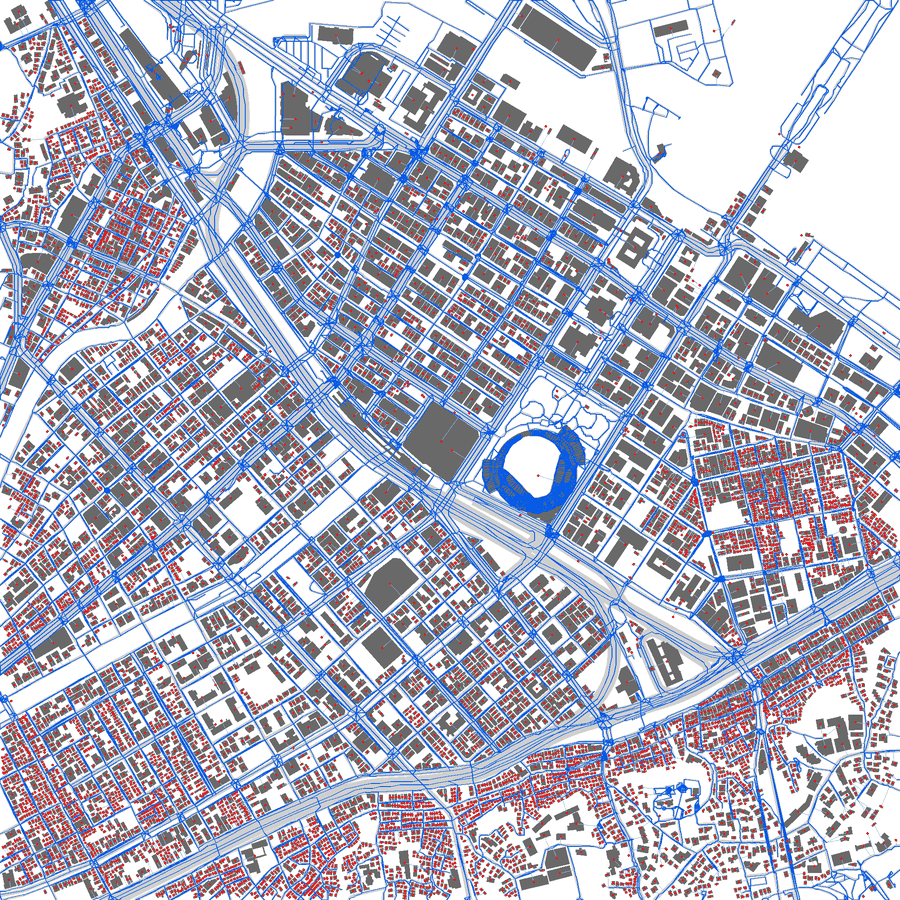
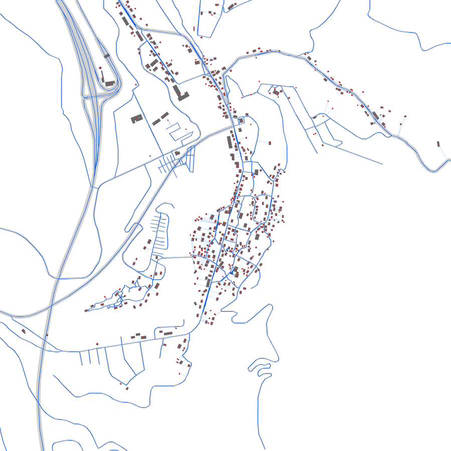
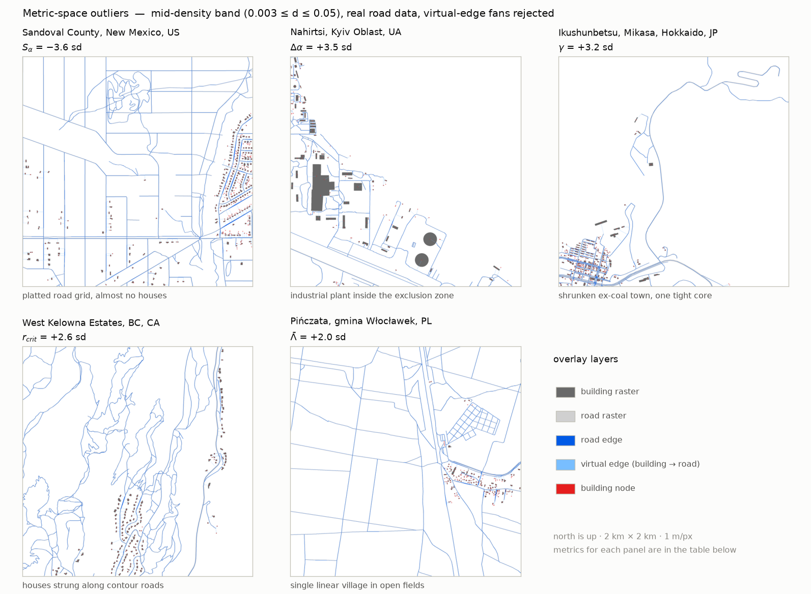
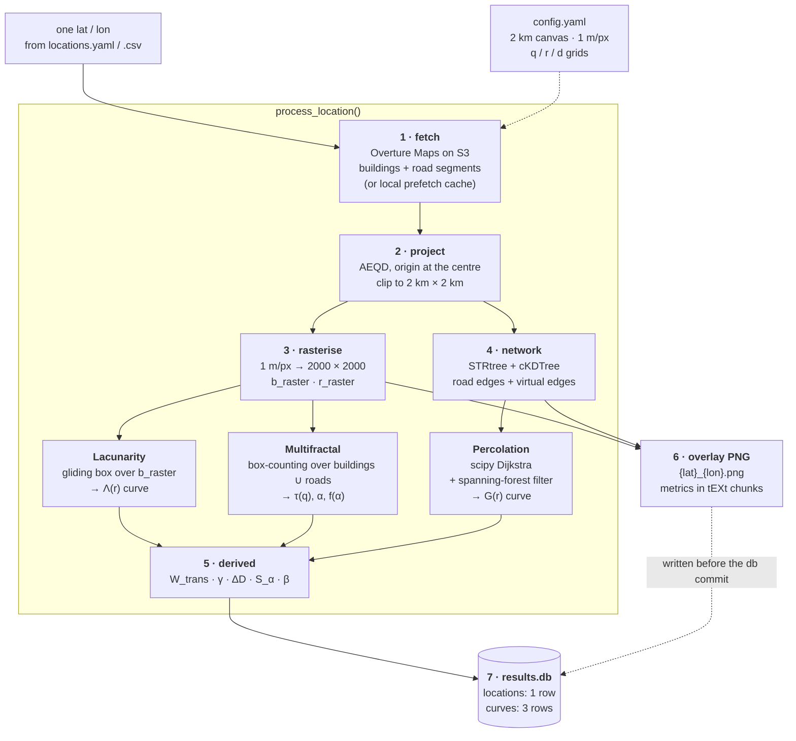
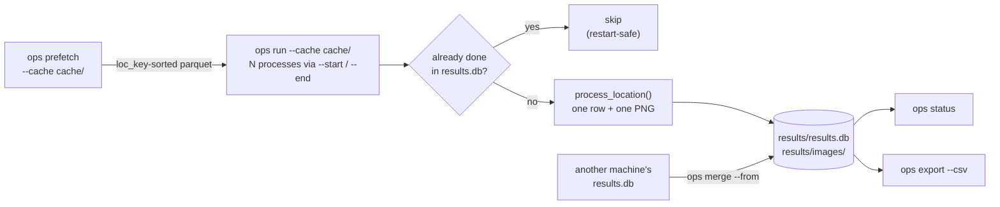
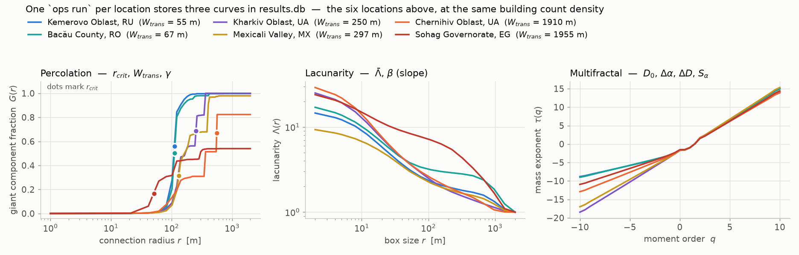
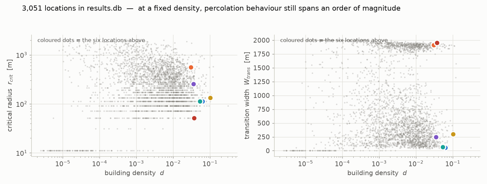

# opensparsity

**English** · [日本語](README.ja.md)

An Open-Sparsity indicator pipeline for urban space. Give it a latitude/longitude and it
pulls buildings and roads from [Overture Maps](https://overturemaps.org/), rasterises them,
builds a connectivity network, and computes lacunarity, multifractal, percolation and
derived indicators.

**One location produces exactly one image and one SQLite row** — no intermediate files:

```
results/
├── results.db            # every location's indicators, curves and status (the only numeric artefact)
└── images/
    └── {lat}_{lon}.png   # building/road raster + network overlay (metrics embedded as PNG metadata)
```

A port and redesign of the older `251229_repro_apple` repository (1 location = 7 files,
8–15 MB). Here it is roughly 0.1–0.8 MB per location plus a few KB in the database.

---

## What a run looks like

Each processed location gets a 2000×2000 overlay: buildings in dark grey, road raster in
light grey, road network edges in blue, virtual building→road edges in pale blue, building
nodes as red dots. North is up.

| Yokohama — `d = 0.306`, `r_crit = 92 m` | Shirakawa-go — `d = 0.016`, `r_crit = 72 m` |
| :--- | :--- |
|  |  |

Same 2 km × 2 km canvas, same code path — two very different structures.

### Five outliers from the corpus

That pair is the easy contrast — one dense, one sparse. The more interesting cases are the
ones that are extreme in the **indicator space rather than in density**. Filtering
`results.db` down to the mid-density band (0.003 ≤ *d* ≤ 0.05), to locations that actually
have road data, and to transitions that complete inside the 2 km window leaves 1,458
candidates. Ranking those by Mahalanobis distance in the z-scored 9-D OS vector — and
rejecting virtual-edge fans — gives these:

<picture>
  <source media="(prefers-color-scheme: dark)" srcset="docs/assets/outliers_dark.png">
  
</picture>

| Place | Why it is an outlier | *d* | Λ̄ | r_crit | W_trans | γ | Δα | S_α | bldg |
| :--- | :--- | ---: | ---: | ---: | ---: | ---: | ---: | ---: | ---: |
| Sandoval County, New Mexico, US | S_α = **−3.6 sd** | 0.0111 | 23.3 | 92 m | 321 m | 0.0064 | 1.81 | −0.30 | 380 |
| Nahirtsi, Kyiv Oblast, UA | Δα = **+3.5 sd** | 0.0290 | 16.8 | 294 m | 1913 m | 0.0089 | 2.42 | +0.19 | 125 |
| Ikushunbetsu, Mikasa, Hokkaido, JP | γ = **+3.2 sd** | 0.0080 | 35.9 | 72 m | 101 m | 0.0194 | 2.10 | +0.21 | 239 |
| West Kelowna Estates, BC, CA | r_crit = **+2.6 sd** | 0.0077 | 34.4 | 1546 m | 1465 m | 0.0067 | 1.79 | +1.17 | 148 |
| Pińczata, gmina Włocławek, PL | Λ̄ = **+2.0 sd** | 0.0032 | 70.8 | 92 m | 144 m | 0.0155 | 1.76 | +0.99 | 165 |

- **Sandoval County** carries 11.2 km/km² of road with buildings in one corner only — a
  platted subdivision that was never built out. Ordinary on density, −3.6 sd on S_α.
- **Ikushunbetsu** is a shrunken coal town: one tight core in an otherwise empty valley,
  which makes it the sharpest percolation transition in the pool (W_trans = 101 m).
- **West Kelowna** is terrain-constrained — houses follow contour roads, so the network
  connects locally but needs 1.5 km to connect globally.
- **Nahirtsi** sits inside the Chornobyl exclusion zone, ~2 km east of the plant; the mix of
  very large halls and small structures gives the widest singularity spectrum here.

The fan rejection matters more than it sounds. When buildings sit far from any road they all
snap to the same nearest road point, and the overlay fills with a pale-blue fan — an artefact
of missing road data, not a spatial pattern. `render.py` draws each layer in an exact RGB
without antialiasing, so the fan is detectable straight from pixel counts: **84 of the top
120 outlier candidates were rejected this way** (virtual-edge / road-edge pixel ratio ≥ 0.35;
pool median 0.57). Without that filter the ranking is almost entirely artefacts.

---

## Pipeline



Modules are mutually independent: `fetch` / `project` / `raster` / `network` /
`indicators/*` can each be imported and used on their own. Only `pipeline.py` wires them
together.

### The batch layer



`prefetch` exists because a per-location S3 scan costs ~100 s regardless of location. It
matches every bounding box against the global parquet in one pass (resumable via
`manifest.json`), after which `run` reads locally.

---

## Indicators and the curves behind them

One `ops run` per location writes three curves to `results.db`, and the scalar indicators
are read off them:

<picture>
  <source media="(prefers-color-scheme: dark)" srcset="docs/assets/curves_dark.png">
  
</picture>

| Column | Symbol | Meaning |
| :--- | :--- | :--- |
| `density` | *d* | Covered-area ratio (GSI): mean of the building raster |
| `building_count_density` | — | Buildings per km² |
| `building_footprint_mean_m2` / `_median_m2` | — | Footprint size distribution |
| `road_length_density` | — | Road length (km) per km² |
| `lacunarity_mean` | Λ̄ | Mean lacunarity over the box-size sweep |
| `lacunarity_slope` | β | Decay rate of Λ(r) ~ r^(−β). Steep = gaps vanish on zoom-out; shallow = patchy at every scale |
| `mfa_alpha_width` | Δα | α_max − α_min — width of the singularity spectrum |
| `mfa_D0` | D₀ | Box-counting dimension |
| `r_crit` | r_crit | argmax_r dG/dr — the connection radius where the network snaps together |
| `perc_dcrit` | — | Auxiliary: the G(r) = 0.5 crossing |
| `perc_gmax` | — | Largest giant-component fraction reached |
| `W_trans` | W_trans | r(G=0.9) − r(G=0.1). Narrow = one abrupt merge; wide = a long grind |
| `gamma` | γ | dG/dr at r_crit — how explosive the transition is |
| `Delta_D` | ΔD | D₀ − D₂ — concentration strength of the mass |
| `S_alpha` | S_α | Skewness of f(α): which tail of the density range carries the complexity |
| `beta` | β | Same value as `lacunarity_slope`, kept under its Table-1 name |

Curves are kept so that a newly conceived indicator can be computed from the database
alone, without re-fetching.

### Across a corpus

`density` on its own collapses a lot of structure. Over the locations currently in
`results.db`, the percolation behaviour at any fixed density still spans an order of
magnitude:

<picture>
  <source media="(prefers-color-scheme: dark)" srcset="docs/assets/corpus_dark.png">
  
</picture>

`experiments/exp01_density_breakdown/` takes this further, estimating the density levels at
which the discriminative contribution of *d* breaks down against a uniform baseline.

---

## Setup

```bash
uv venv --python 3.12 .venv
uv pip install --python .venv/bin/python -e .

# for the figures and the experiment scripts
uv pip install --python .venv/bin/python -e ".[analysis]"
```

## Usage

```bash
# Run. Crash or interrupt it and rerun — processed locations are skipped.
.venv/bin/ops run --locations locations.yaml --out results/

# Parallel batches (safe against the same db — WAL mode)
.venv/bin/ops run --locations all.csv --out results/ --start 0    --end 2500 &
.venv/bin/ops run --locations all.csv --out results/ --start 2500 --end 5000 &

# Bulk-prefetch Overture data first, then run against the local cache
.venv/bin/ops prefetch --locations all.csv --cache cache/
.venv/bin/ops run --locations all.csv --out results/ --cache cache/

# Progress
.venv/bin/ops status --out results/

# Pull in another machine's results (UPSERT)
.venv/bin/ops merge --from /mnt/other/results.db --out results/

# Out to CSV for analysis
.venv/bin/ops export --out results/ --csv metrics.csv
```

Useful flags: `--force` recomputes locations already marked done; `--no-image` skips the
overlay and writes numbers only.

Location lists are YAML (`{locations: [{name, lat, lon}, ...]}`, or the legacy
`coords: [lat, lon]` form) or CSV (`lat, lon[, name]` columns).

## Design

- **`results.db` is the source of truth**: `locations` (indicators + status) and `curves`
  (percolation / MFA / lacunarity).
- **Every row records the code version and the Overture release**, so which implementation
  and which data produced a value is always traceable.
- **Resumable**: UPSERT on the primary key `(lat, lon)` plus a status column.

## Notes on the computation

The compute core was ported as-is from the older repository, where it was optimised and
verified:

- Network construction: STRtree / cKDTree (verified to produce bit-identical graphs to the
  earlier brute-force implementation).
- Percolation: scipy Dijkstra + minimum-spanning-forest filter (agrees with the earlier
  networkx implementation at every threshold across 7 locations).
- Old Overture releases disappear from S3. When `fetch` starts reporting
  *"No files found"*, bump `OVERTURE_RELEASE` in `fetch.py`.

## Reference timings

Apple Silicon, 2 km² at 1 m/px: fetch takes about 100–120 s (near-constant across
locations) plus 5–35 s of computation, which grows with the square of the building-node
count — 35 s for Kibera at 14,000 building nodes.

## Regenerating the figures

The README figures are generated from `results.db`, so they track the data:

```bash
.venv/bin/python docs/make_figures.py --db results/results.db --out docs/assets
```

It emits light/dark pairs (the `<picture>` blocks above switch on GitHub's theme) and
downsized copies of the overlay PNGs. Labels are kept in English + mathematical notation so
both READMEs share the same images; the numbers live in the tables, not baked into the
figures.

The five outliers are pinned in `OUTLIERS` so the figure and the table above cannot drift
apart. To re-run the ranking against the current database instead:

```bash
.venv/bin/python docs/make_figures.py --reselect
```

## Repository layout

```
src/opensparsity/
├── cli.py            ops run / prefetch / merge / status / export
├── pipeline.py        the only module that wires the others together
├── fetch.py           Overture on S3 + local cache reader
├── prefetch.py        bulk extraction (static / join modes)
├── project.py         AEQD projection and clipping
├── raster.py          rasterisation
├── network.py         graph construction
├── render.py          overlay PNG
├── store.py           results.db
└── indicators/        lacunarity · multifractal · percolation · advanced
docs/                  research framing, technical notes, figure script
experiments/           exp01 density breakdown, exp02 iso-density pairs, ...
```
