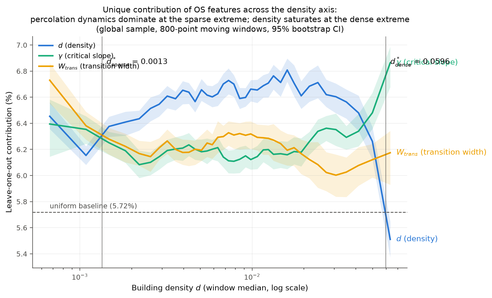
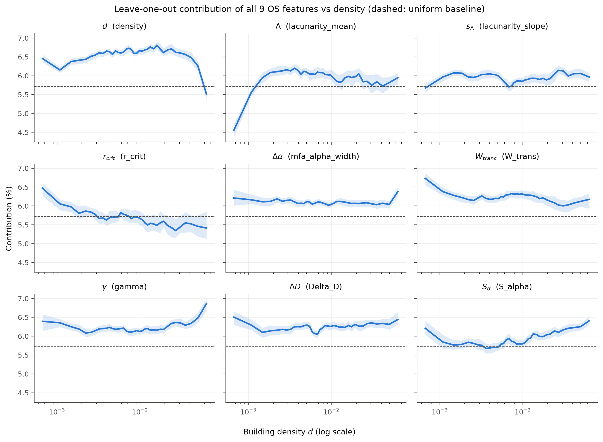

# Exp01 実行レポート: 密度の情報崩壊点の推定（Density Breakdown Curve）

**実行日**: 2026-07-08 / **データ**: global_v2 全球層化サンプル（解析対象 10,050地点） /
**コード**: opensparsity `fb7a4ea` 以降（r_crit = 論文表1定義）

## TL;DR

> 卒業論文の知見「低密度では識別決定要因が量（密度）から相転移ダイナミクスへ移行する」は、
> 全球 N≈10,000 では**「密度軸の両極端で成立する」形に精緻化される**。
> 疎側の極（d < d\*_sparse ≈ **0.0013**）ではパーコレーション系指標（W_trans, r_crit）が
> 固有情報の主役となり、密側（d > d\*_dense ≈ **0.060**）では密度の固有寄与が
> 無相関基準を割り込んで崩壊し γ が最大の寄与に躍り出る。
> 中間帯（0.002–0.05）では密度も固有情報を保持する。
> 卒論の6地点探索（d≈0.012–0.028帯）の数値そのものは全球では再現しないが、
> より強い形の主張——**OS空間の9特徴がほぼ直交的に機能し、
> ダイナミクス指標は全密度帯で一様基準以上の固有情報を持つ**——が得られた。

## 1. 設計（詳細は README.md）

- 9次元 OS ベクトル（論文表1）を全地点で構築。**r_crit は表1定義（argmax dG/dr）で
  保存済み percolation 曲線から再導出**（旧実装の G=0.5 交差は不使用）
- 密度昇順の移動窓（W=800地点、step 250、38窓）ごとに、卒論§感度分析と同一の
  leave-one-feature-out 平均ペア距離減少率(%)を計算
- **一様基準 5.72%**: 9特徴が無相関なら任意の1特徴除去で 1−√(8/9) だけ距離が減る。
  基準超過 = 固有（非冗長）情報を持つ / 基準未満 = 他特徴と冗長
- 95%CI: 窓内ブートストラップ（B=100）+ サブリージョン・ブロックブートストラップ
  （空間自己相関の頑健性、B=100）

## 2. 結果





### 2.1 レジーム境界（d\* の推定）

| 境界 | 値 | 定義 |
|---|---|---|
| **d\*_sparse** | **0.00134** | これより疎で (γ+W_trans)/2 の寄与が密度を上回る |
| **d\*_dense** | **0.0596** | これより密で密度の寄与が一様基準 5.72% を割り込む |

### 2.2 疎側の極（最疎窓 d~0.0007、ブロックブートストラップ95%CI）

| 特徴 | 寄与 | ブロックCI | 判定 |
|---|---|---|---|
| **W_trans** | **6.73%** | [6.56, 6.85] | 基準超・最大 |
| r_crit | 6.47% | [6.34, 6.58] | 基準超 |
| ΔD | 6.5% | — | 基準超 |
| density | 6.45% | [6.32, 6.56] | 基準超 |
| γ | 6.39% | [6.15, 6.69] | 基準超 |
| **lacunarity_mean (Λ̄)** | **4.55%** | [4.22, 4.83] | **基準を大きく割込み＝冗長化** |

疎の極では**パーコレーション系（W_trans, r_crit）と質量集中（ΔD）が固有情報の担い手**。
一方、卒論で10倍の分別力を示した Λ̄ は「疎密の分別」には効くが、
**iso-density帯の内部では他特徴と冗長**であることが判明（4.6% ≪ 5.72%）。

### 2.3 密側の極（最密窓 d~0.063）

| 特徴 | 寄与 | ブロックCI | 判定 |
|---|---|---|---|
| **γ** | **6.86%** | [6.71, 7.10] | 基準超・最大。density とCI非重複 |
| S_α | 6.41% | [6.20, 6.64] | 基準超 |
| **density** | **5.51%** | [5.35, 5.67] | **基準割込み＝冗長化（飽和）** |
| r_crit | 5.41% | [5.04, 5.83] | 基準付近まで低下 |

密側では密度が飽和して冗長化し（他の形態指標から復元可能な情報しか持たない）、
**「いかに連結するか」（γ）が識別の最大寄与**になる。卒論の物語がこちら側の極でも成立する。

### 2.4 卒論の低密度帯（d 0.012–0.028）での照合

| d_median | density | γ | W_trans | Λ̄ | r_crit |
|---|---|---|---|---|---|
| 0.012–0.028 | **6.6–6.8%** | 6.2–6.4% | 6.0–6.3% | 5.8–6.0% | 5.4–5.6% |

この帯では**密度が最大の固有寄与**を持ち、卒論の6地点探索（密度5%台 < γ約7%）とは
順位が一致しない。差の要因: (a) 卒論はN=4（ペア6組）の探索的推定で統計的ノイズが大きい、
(b) 卒論の4地点は形態的多様性を狙って**選定**された地点であり、
無作為な iso-density 帯の内部変動とは比較対象が異なる。
卒論自身が「統計的一般化を主張しない」と明示しているため矛盾ではないが、
**全球スケールの主張は本レポートの形（両極端でのダイナミクス支配）で述べるべき**。

## 3. 解釈

1. **「密度が機能を失う」は2つの異なるメカニズムで起きる**:
   疎側では建物がまばらすぎて配置の自由度が支配的になり（接続プロセス指標が独自情報を持つ）、
   密側では密度が飽和して他の形態指標と縮退する（γ が唯一伸びる）
2. **OS特徴空間の設計妥当性**: 全38窓×9特徴の寄与は 4.6–6.9% に収まり
   一様基準 5.72% の近傍に分布する。すなわち9特徴は**概ね直交的**で、
   極端な冗長は疎端の Λ̄ と密端の density のみ。「単一指標ではなく特徴空間」という
   論文の設計思想を全球データが支持する
3. **道路ネットワーク媒介パーコレーション（独自性）の価値**: W_trans と γ は
   **全密度帯で一様基準以上**を維持する唯一の指標ペア。前回スイープで
   「d_crit50 が Quintile を分別しない」と見えた問題は、成功基準の取り違え
   （疎密の分別は密度の仕事）であり、**iso-density 帯内部の構造識別**という
   本来の役割ではダイナミクス指標は一貫して機能している

## 4. 制約

- 寄与の定義は「z-score空間の平均ペア距離に対する固有（非冗長）寄与」であり、
  外的な形態ラベルに対する識別性能ではない（ラベル付き検証は今後の課題）
- 窓は密度ソートで構成されるため、窓内の密度変動は幅が狭い（分位帯内の変動）。
  windows の幅・ステップへの感度は W=800/step250 でのみ確認
- データは旧 Overture リリースの global_v2 処理結果。指標間の相対比較が目的のため
  二次的だが、新リリースでの再現は opensparsity パイプラインで実施可能
- percolation 曲線の無い 487地点（建物極少など）を除外しており、
  最疎端は選択バイアスの可能性（除外は建物数不足に偏る）

## 5. 論文ネクストステップへの示唆

1. 「低密度領域で密度は情報を失う」の全球版は
   **「d < 0.0013 ではパーコレーション動特性が、d > 0.06 では γ が識別を支配し、
   密度が固有情報を持つのは中間帯のみ」**という2境界の主張として書ける
   （d\* は仮定ではなく推定値。0.03 という先験的しきい値は不要になった）
2. 疎端における Λ̄ の冗長化は「ラキュナリティは疎密の指標、ダイナミクスは
   疎の内部構造の指標」という役割分担として整理できる（Fleischmann の
   Index of Elements 語彙とも整合）
3. 外的妥当性の次の一手: iso-density ペアの overlay 画像（opensparsity の
   `{lat}_{lon}.png`）を用いた定性検証、および DEGURBA クラスによる層別再現

## 再現手順

```bash
cd opensparsity
.venv/bin/python experiments/exp01_density_breakdown/compute_os_vectors.py   # 曲線→9次元ベクトル
.venv/bin/python experiments/exp01_density_breakdown/analyze_breakdown.py   # 移動窓感度分析+図
```

入力データ: WSL `~/dev/OS/251229_repro/outputs/`（metrics_global_v2_batch*.csv と
real_world_global_v2/*/{percolation,mfa_spectrum}.csv、2026-07-08 転送分）
