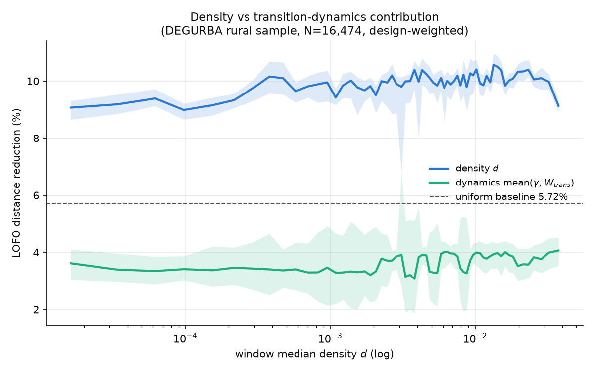
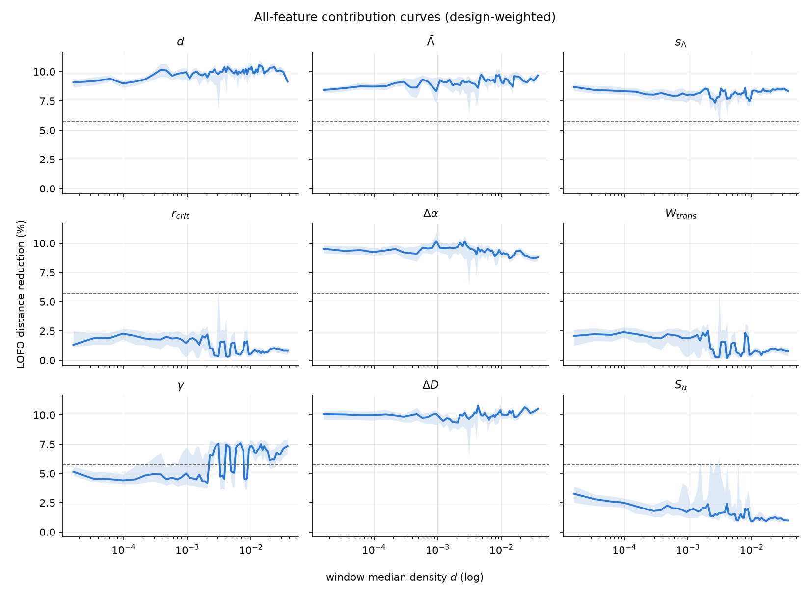
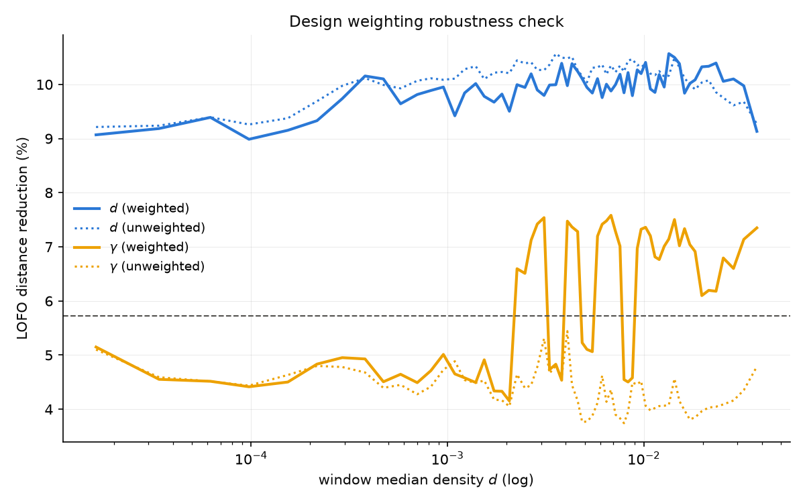

# Exp05 実行レポート: DEGURBA疎居住センサスの密度崩壊分析

**実行日**: 2026-07-13 / **データ**: DEGURBA層化サンプル本番実行の実現サンプル
（done 16,474地点、design_weight再計算済み） / **手法**: exp01と同一のLOFO感度分析
（一様基準 5.72%）を design_weight 付きで実施

## TL;DR

> **exp01（global_v2全球サンプル）の「疎の極でパーコレーション系が主役」は、
> DEGURBA rural限定の母集団では再現しない。** rural帯（d ≈ 10⁻⁵〜10⁻¹）全域で
> 固有情報の主役は **d・Λ̄・s_Λ・Δα・ΔD の5特徴（8〜10%）**であり、
> **r_crit・W_trans・S_α は全域で冗長（1〜3%）**。
> γ のみ d ≈ 2×10⁻³ を境に固有情報を持ち始める（4.5%→7.5%）が、
> **この γ の立ち上がりは design_weight を掛けたときだけ現れる**
> （重みなしでは基準以下のまま）——すなわち大面積の疎居住層でこそ
> 「転移の鋭さ」が識別に効く、という設計ベース推測ならではの知見。

## 1. データと重み

- 本番バッチ（27,710点試行）の done 16,474点。9特徴すべて完備（NaN除外 0件）
- design_weight は **cos(lat)バグ修正後**の式で実現サンプルに再計算:
  `w_h = 層hの推定全体セル数 / 層hの試行数`（層内一定）。
  empty(failed)は無作為欠測でなく「Overtureに何も無いセル」という構造カテゴリとして
  分離し、doneの重みには繰り入れない（`build_dataset.py` docstring参照）
- empty率は層別に大きく異なる: **very_low 67.5% vs low 14.3%**。
  最高はMelanesia very_low 93.9%、最低はWestern Europe low 0.0%
  （`stratum_realized.csv`）。この差が実態（真の無人）か
  Overture未記載かの切り分けは §4 のバイアス検証で行う

## 2. 結果

### 2.1 全域で固有情報を持つ特徴（rural帯、重み付き全体）

| 特徴 | 全体寄与 | 判定 |
|---|---|---|
| ΔD | 12.2% | 基準超・最大 |
| Δα | 10.2% | 基準超 |
| s_Λ | 8.7% | 基準超 |
| γ | 7.9% | 基準超（ただし密度依存、§2.2） |
| Λ̄ | 6.9% | 基準超 |
| d | 6.4% | 基準超 |
| S_α | 2.3% | **冗長** |
| W_trans | 2.0% | **冗長** |
| r_crit | 1.9% | **冗長** |

移動窓で見ると d は全窓で 9〜10%——**rural帯の内部では密度は崩壊しない**。
exp01 の d\*_sparse ≈ 0.0013（これより疎でダイナミクスが密度を上回る）は
本サンプルでは観測されない（どの窓でも d ≫ γ, W_trans）。

### 2.2 γ の立ち上がりと design_weight の効果

- γ は d < 2×10⁻³ で 4.5〜5%（基準以下）、d > 2×10⁻³ で 6〜7.5%（基準超）に遷移
- **この遷移は重み付きでのみ出現**（重みなしは全域 ~4%）。重みは推定全体セル数に
  比例するので、γ の固有情報は「セル数の多い＝広大な疎居住層」で強いことを意味する
- 窓ごとの振動が大きい（窓内のサブリージョン構成が変わるため）。
  サブリージョン層別の追試が次の課題

### 2.3 exp01 との食い違いの解釈（正直な注記）

exp01 は疎の極（d~0.0007）で「9特徴ほぼ直交、W_trans/r_crit が主役」だった。
本実験は同じ密度帯で W_trans/r_crit が冗長。指標定義は同一
（`find_r_crit_max_slope` = argmax dG/dr、パイプラインが同じ関数を使用）なので、
差の候補は:

1. **母集団定義**: global_v2 は WSF（既知の集落）アンカーの5分位×22サブリージョン。
   本実験は GHS-SMOD の rural セル一様抽出——「集落があるとは限らない場所」を含む。
   建物数が極端に少ない bbox では percolation 曲線が退化し、W_trans・r_crit が
   互いに（また建物数と）強く相関 → 冗長化する、が最有力仮説
2. **ネットワーク構築差（卒論の制約L3）**: exp01 の曲線は旧リポジトリのパイプライン
   由来。スナップ許容度等の構築パラメータ差が percolation 系指標に効く可能性
3. 除外規則の差: exp01 は percolation 曲線が無い地点を除外（10,068/10,555）。
   本実験の done はグラフが構築できた地点のみで同種のフィルタだが閾値挙動が違う

**論文への含意**: 「疎ではダイナミクスが主役」という単純な物語は成立しない。
代わりに (a) rural帯の識別の主役は質量分布系（ΔD, Δα）と空隙系（Λ̄, s_Λ）、
(b) γ は面積加重でのみ疎側の中〜上部で効く、(c) 密度は rural帯**内部**では
崩壊しない（exp01の崩壊は密側の極 d>0.06 でのみ確認済み）、という
より精密な三部構成になる。

## 3. 除外・頑健性

- NaN除外: 0件（16,474点すべて9特徴完備）
- 重み付き vs 重みなし: d はほぼ不変（頑健）。γ のみ重みで結論が変わる（§2.2）
- ブートストラップ95%CI（B=100、窓内再抽出）を全窓で計算済み
  （`window_contributions.csv` の `*_lo`/`*_hi` 列）

## 4. Overtureカバレッジバイアス検証（2026-07-13 実施）

GHS-BUILT-S E2025（衛星由来の建物被覆、Overtureの地図書き込みと独立）を
各地点の3km近傍平均でサンプリングし、empty を「真の無人」と「未記載疑い」に分解した
（閾値: 1kmセルあたり built-up 1,000m²）。

**結果（`overture_bias_by_stratum.csv`）**:

- 全体の empty 40.5% の内訳 = **真のempty 33.7% + 未記載疑い 6.8%**。
  つまり**emptyの83%は衛星でも何も無い正真正銘の無人地**であり、
  「emptyはOvertureの欠陥」という批判には全体としては当たらない
- done地点の log-density（Overture GSI）vs log-GHS built-up の相関 **r=0.814**。
  Overtureの被覆率測定は衛星ベースの独立測定と強く整合する
- **ただし未記載疑いは特定の層に集中**: Eastern Africa low **37.1%**、
  Caribbean low 34.3%、Melanesia low 31.0%、Eastern Asia low 24.1%、
  Central Asia low 19.3%。**low_density_rural × アフリカ・島嶼・アジア内陸**が
  Overtureの弱点で、これらの層の推定値は過小カバレッジの影響を受ける

**論文への含意**: (a) 全体の測定妥当性は主張できる（r=0.81、真のempty優勢）、
(b) 未記載疑い率を層別の品質指標として表に載せ、高率の層（>20%）は感度分析で
除外しても結論が変わらないことを示すべき、(c) empty率のクラス差（§1）は**性質が正反対**である点を明記する:
very_low の empty 66.8% は真の無人 64.5% + 未記載 2.2%（=ほぼ本物の無人地）、
low の empty 13.9% は真の無人 3.8% + 未記載 10.1%（=**大半がデータ欠落**）。
したがって very_low の empty はそのまま「疎らさの分布」として解釈できるが、
low の empty を実態として扱ってはならない。

## 6. 指標の冗長性ジオメトリ（2026-07-14）

対話型カタログで「指標ダイヤルを回すとハイライト帯がUMAP上で指標ごとに違う向きへ動く」
という観察を定量化した（`redundancy_geometry.py` → `redundancy_geometry.png`）。
「動く向き」＝その指標のUMAP勾配で、平行なら冗長・直交なら独立と読める。

### 6.1 12指標は実質3軸に潰れる

相関行列の固有値スペクトルから、**参加率 PR=3.15、固有値>1の主成分3本、
累積90%到達に5軸**。ダッシュボードの12ダイヤルは実効的に約3本の独立ノブしかない。

### 6.2 三家族（コンパスと階層クラスタで一致）

- **量・被覆の家族**（勾配 +50〜80°）: d・N_b・Ā_b・L_r・Δα。互いに強い正相関で冗長
- **疎・鋭さの家族**（−120°、量家族のほぼ真逆）: Λ̄・s_Λ・γ。「疎の極へ動かす」操作
- **独立/島検出**: W_tr・ΔD・S_α（＋r_crit）。それぞれ固有方向

階層クラスタの並びは `[S_α, W_tr, ΔD | r_crit, Ā_b, L_r, Δα, N_b, d | Λ̄, s_Λ, γ]`。
**r_crit はコンパスでは独自方向（28°）だが特徴量空間では量家族と同ブロックに入る**——
UMAP勾配（可視化）と特徴量相関（真値）が食い違う代表例で、
§冒頭の「コンパスは可視化であって真実ではない」という注意そのもの。

### 6.3 「平均冗長だが離散検出には唯一効く」の幾何学版

島（長距離転移形態）を分離する力 |sep|>0.4 の指標は
**W_tr(+0.50)・r_crit(+0.49)・S_α(+0.49)・γ(−0.49)・ΔD(−0.48)**。
このうち W_tr・r_crit・S_α は §2.1 のLOFOで「全域で冗長（寄与1〜3%）」だった指標。
すなわち**平均分散への寄与は小さいが、密度では見えない離散形態（広域散居の島）を
名指しできるのはこの群だけ**——exp05 LOFOのパラドックスの視覚・幾何版であり、
「転移ダイナミクス指標が平均寄与ではなく離散構造の検出で価値を持つ」という
論文の主張を裏づける第2の独立な証拠。

### 6.4 論文への含意

OSを「少数の独立な構造軸を張る距離空間」と位置づける卒論のフレーミングを補強する。
特に W_trans/r_crit の存在意義は「平均的な識別への寄与」ではなく
「量（密度）では捉えられない離散形態の検出」にあると、幾何学的に明示できる。

成果物: `redundancy_geometry.png`（コンパス+相関ブロック+有効次元の3枚組）、
`redundancy_metrics.csv`（勾配方向・島分離力）、`spearman_matrix.csv`。

## 成果物

- `build_dataset.py` / `realized_sample.csv`（16,474行）/ `stratum_realized.csv`（44層）
- `weighted_breakdown.py` / `window_contributions.csv` / `overall_contributions.csv`
- `breakdown_curve.png` / `contribution_all_features.png` / `weighting_robustness.png`
- `overture_bias_check.py`（実行待ち）
